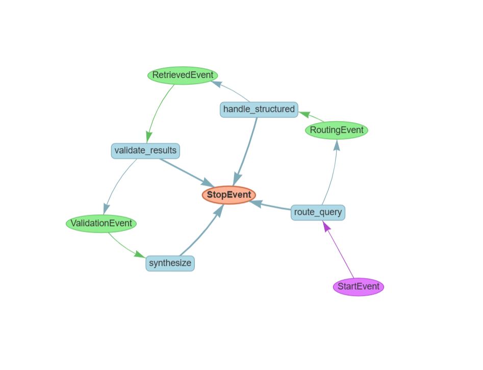

# 🤖 Agentic RAG System - Multi-Layer Architecture

מערכת RAG מתקדמת מבוססת סוכנים (Agents) המשלבת חיפוש סמנטי (Vector Search) ושליפת נתונים מובנים (Structured Data).

## 📊 Workflow Architecture

## 🎯 מטרת הפרויקט
בניית סוכן חכם היודע לנתב שאלות משתמש למסלול השליפה האופטימלי:
1. **מסלול מובנה (Structured):** שליפת מידע מדויק מקבצי JSON (החלטות, אזהרות, הנחיות).
2. **מסלול סמנטי (Semantic):** חיפוש מבוסס הקשר במסמכי הפרויקט.

## 🛠 טכנולוגיות
* **LlamaIndex Workflows:** לניהול זרימת האירועים והניתוב.
* **Groq (Llama 3):** כמודל שפה מרכזי (LLM).
* **Gradio:** ממשק משתמש אינטראקטיבי.
* **Pydantic:** לאימות נתונים וחילוץ סכמה.

## 🚀 איך להריץ?
1. התקינו דרישות: `pip install -r requirements.txt`
2. הגדירו מפתח API בקובץ `.env`: `GROQ_API_KEY=your_key`
3. הריצו את המערכת: `python main.py`

## ❓ דוגמאות לשאלות שהסוכן יודע לענות
* **שליפה מובנית:** "תני לי רשימה של כל ההחלטות הטכניות."
* **שליפה סמנטית:** "למה בחרנו להשתמש במודל Groq?"
* **אימות:** "מה צבע הכפתורים במערכת?"